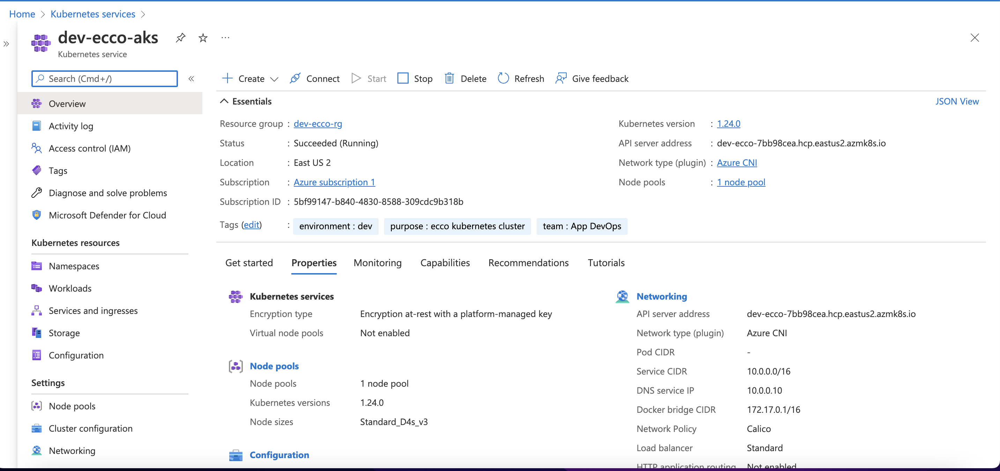

# Creating a kubernetes cluster in Azure Cloud using Terraform 

This is tutorial provides a Terraform code to deploy Azure Kubernetes Service (AKS) cluster in azure Cloud. The Azure Kubernetes Service (AKS) is a fully managed Kubernetes service for deploying, managing, and scaling containerized applications on Azure. 


### Tools and platforms

- `Azure`:  Microsoft Azure, often referred to as Azure, is a cloud computing service operated by Microsoft for application management via Microsoft-managed data centers. You can get started with 12 months of free cloud computing services and $200 Azure credit for 30 days.

- `Terraform`: is an open-source infrastructure as code software tool that enables you to safely and predictably create, change, and improve infrastructure.

- `Kubernetes`: Kubernetes, also known as K8s, is an open-source system for automating deployment, scaling, and management of containerized applications.

### Assumption And Prerequisites

- You have created an Azure account, with a subscription.
- You have the latest `az` installed in your device.
- You have the latest `kubectl` installed in your device.
- You have the latest `terraform` installed in your device.


### Provision Azure resources with Terraform

#### 1- Set up an Azure account

To gain access to the Microsoft Azure management portal, you must have an Azure subscription and a Microsoft account associated with that subscription. To sign up for an Azure subscription

1- On the Microsoft [Azure page](https://go.microsoft.com/fwlink/?LinkID=285197), log in with a Microsoft account.


2- Choose Free Trial and follow the instructions to create a new account. Alternatively, choose Purchase Options and then choose the agreement that suits your purpose.

When your account is set up successfully, the Subscriptions page of the Account Center appears.


#### 2- Create a storage account for Terraform state file

You can link your Azure CLI to your account with:

```terminal|command=1|title=bash
az login
```

And you can list your accounts with:

```terminal|command=1|title=bash
az account list
```

**Make a note now of your subscription id.**

> If you have more than one subscription, you can set your active subscription with `az account set --subscription="SUBSCRIPTION_ID"`. 

Also setup the subscription ID as environment variable to be used later by Terraform

```terminal|command=1|title=bash
export TF_VAR_tenant_id="SUBSCRIPTION_ID"
```

Then follow the instruction [here](https://go.microsoft.com/fwlink/?LinkID=285197) to create Azure Storage account to
Store Terraform state that will be used in provider.tf file.

#### 3- Provisioning a cluster using Terraform

**Create multi-layer terraform state**
It is best practice to split the terraform into multi-layer architecture depending on complexity of the application environment. The principle is based on dividing the infrastructure into logical layers and representing these layers in the form of separate directories. The deployment of an infrastructure will therefore no longer be done by running Terraform in a single directory, but in as many directories as there are layers.

As an example here, we will split terrafrom into two layers:
1- network and security layer
2- compute and storage layer


- First, verify that the Terraform tool has been installed correctly with:

```bash
terraform version
```

- Then, set the working directory to the first layer directory

```bash
cd azure_terraform/network_security
```


- Initialize tge Terraform code

```bash
terraform init
``` 

- Verify the formatting, and the code validity 

```bash
terraform fmt
terraform validate
``` 

- Plan the terraform code and direct the output to a json file 

```bash
terraform plan --var-file=dev.tfvars --out=dev_plan_outputs.json
```

- Apply the terraform code from the json file that was created with the command perfomed above 

```bash
terraform apply "dev_plan_outputs.json"
```

For production environment use the same steps above and replace `dev.tfvars` by `prod.tfvars`, `dev_plan_outputs.json` by `prod_plan_outputs.json` 

- Switch back to the second layer directory (compute_storage) and perform the above steps again to initiate, plan and deploy the second layer infrastructure.


#### 4- Terraform Deployment log:

- Terraform Apply

[first layer terraform apply](https://github.com/besha100/azure_terraform/blob/main/assests/network_security_apply.txt)

[second layer terraform apply](https://github.com/besha100/azure_terraform/blob/main/assests/tf_apply.txt)

- The AKS cluster in Azure portal



